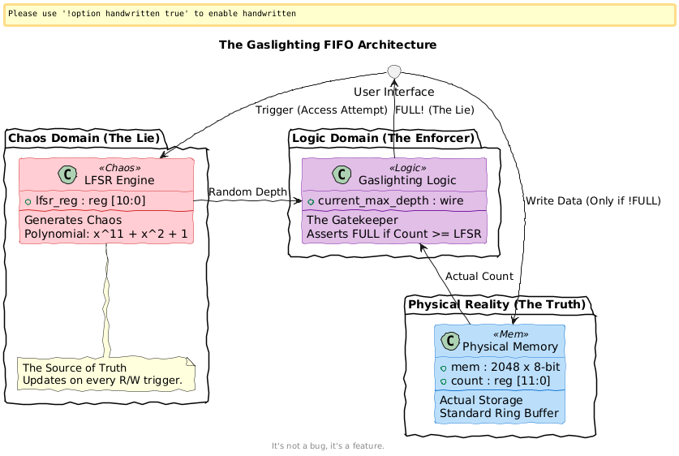
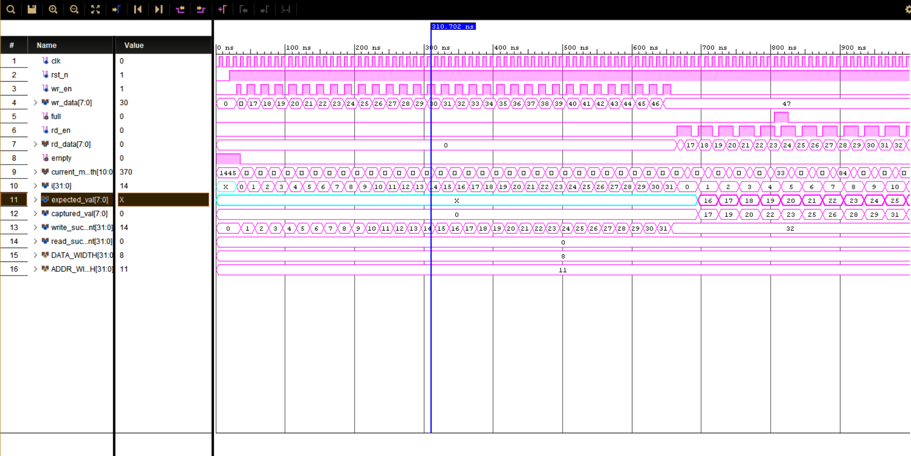
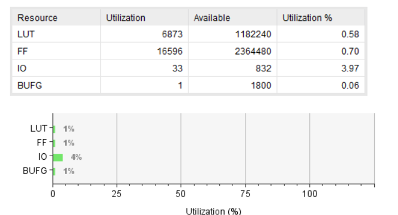
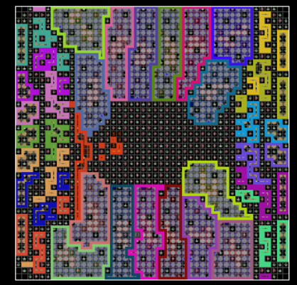
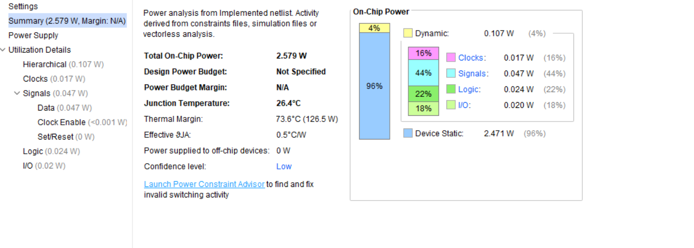

# 🎪 The Gaslighting FIF

> _Or: How I Learned to Stop Worrying and Love the Overflow_

---

## 1. Why: The Inspiration 💡

Let’s be honest. Standard FIFOs are the "good students" of digital logic.

- ✅ They are predictable.
    
- ✅ They tell you exactly how much space they have.
    
- ❌ They are **boring**.
    

I was inspired by a teenager who refuses to clean their room. You ask, _"Is there space for this laundry?"_ and they scream **"NO!"** even though the floor is clearly visible. Ten minutes later? _"Yeah, sure, throw it in." Those were the days....

Most engineering students build a FIFO that works. I wanted to build a FIFO that **lies**. I wanted to design a hardware module that suffers from mood swings, where the `FULL` flag isn't a status report—it's an emotional state. So think of this project as something fun.... While most of us design FIFO's with fixed depths, Here the FIFO's depth is random...or...in one word - **CHAOTIC!**

---

## 2. What: The Concept 🧠

**The "Chaos FIFO"** is a standard memory buffer with a severe personality disorder.

## 📜 The Rules of Engagement

1. **Randomized Reality:** Every time you touch it (Read or Write), it rolls a digital die (an LFSR).
    
2. **Shifting Goalposts:** The maximum capacity changes instantly between `1` and `2047`.
    
3. **The "Gaslight" Effect:**
    
    - You write 10 items. You feel good.
        
    - Suddenly, the FIFO decides its max depth is now **5**.
        
    - It screams **FULL!** instantly.
        
    - **You:** _"But I just wrote to you!"_
        
    - **FIFO:** _"I don't know what you're talking about. I am overflowing. Go away."_
        

---

## 3. Constraints & Design Considerations 🚧

Before letting the chaos reign, I had to set some ground rules to make this synthesizable on an FPGA.

|Constraint|Reason|
|---|---|
|**No SystemVerilog**|Pure Verilog-2001 only. SV is for people who like nice things; we chose violence.|
|**No `rand()`**|The randomness must be hardware-generatable (LFSR), not simulation artifacts.|
|**Vivado Compatible**|Must pass Synthesis and Implementation without "black box" errors.|
|**Clock Domain**|Single clock domain (let's not add metastability to the mood swings... yet).|

> [!NOTE]  
> **Key Design Consideration:** The hardest part was decoupling **Physical Memory** from **Logical Capacity**.
> 
> - The chip _actually_ has 2048 registers.
>     
> - The Logic _pretends_ it only has `LFSR_OUT` registers.
>     
> - _Result:_ Data is never actually lost inside the memory array; the FIFO just refuses to let you add more until the mood improves.
>     

---

## 4. How: The Implementation 🛠️

## The Brain (The LFSR)

I didn't use magic. I used math. Specifically, an 11-bit Linear Feedback Shift Register.

verilog

`// The Chaos Engine // Polynomial: x^11 + x^2 + 1 always @(posedge clk or negedge rst_n) begin     if (chaos_trigger) begin        // Shift left and inject the "poison" (feedback)        lfsr_reg <= {lfsr_reg[9:0], lfsr_feedback};    end end`

## The "Refusal" Logic

This is where the gaslighting happens. Normally, `full` means `count == MAX`. Here, `full` is dynamic.

verilog

`// The "Reality" of the FIFO currently assign current_max_depth = lfsr_reg; // "Instantly overflows" if the new random depth is less than current count. assign full  = (count >= current_max_depth);`

---

## 5. Mistakes Were Made (And Lessons Learned) 📉

This project wasn't a straight line; it was as chaotic as the FIFO itself.

## ❌ Mistake 1: The "Zero" Death Spiral

- **The Bug:** My first LFSR implementation initialized to `0`.
    
- **The Result:** An XOR-based LFSR stuck at 0 stays at 0 forever. The FIFO decided its capacity was 0 and refused to work. Ever.
    
- **The Fix:** Added a reset seed `11'h5A5` (non-zero) to kickstart the chaos.
    

## ❌ Mistake 2: The Testbench Stand-off

- **The Bug:** My original testbench was polite. It waited for `!full` before writing.
    
- **The Result:** Deadlock. The FIFO claimed it was full. The testbench waited. The LFSR only updates _on a write attempt_.
    
- **The Fix:** I implemented a **"Stubborn Driver"** in the testbench. It keeps asserting `wr_en` (knocking on the door) to force the LFSR to tick until a favorable depth appears.
    

## ❌ Mistake 3: Mixing Real vs. Fake Pointers

- **The Bug:** I originally tried to reset the `wr_ptr` when the depth changed.
    
- **The Result:** Massive data corruption.
    
- **The Fix:** I learned that **Physical** pointers must remain absolute (`0` to `2048`). Only the **Status Flags** (Full/Empty) should listen to the LFSR. The data is safe; the gatekeeper is just crazy.
    

---

## 6. The Visual Proof (Vivado Reports) 📸

## Schematic View

_Here you can see a normal `FIFO` logic. Our design is similar except for the LFSR, which then controls the `full` flag comparator or in other words depth._  

## Architecture and TB View

_Here you can see the `chaos_trigger` logic feeding into the LFSR, which then controls the `full` flag comparator._  

_This is the `testbench` logic._ 

## Waveforms

_Notice the `full` flag (red line) toggling frantically even when the buffer isn't physically full. That's the panic setting in._  

## Implementation & Utilization

_Notice the `Simple` Design. In depth reports are available in the reports section_  

## Layout

_Just an FPGA image...detailed sch available in docs._  

  
  
  
  

## Power Consumption

_The power analysis shows a very well balanced power consumption profile. There could have been measures to reduce high fanout...but this is not what this project is about...so maybe next time_  

---

## 7. Conclusion 🏁

Why build this?

1. **Robustness:** If your AXI Stream controller can handle _this_, it is bulletproof.
    
2. **Fun:** Watching a waveform where the "Full" flag toggles like a strobe light is oddly satisfying.
    
3. **Life Lesson:** Sometimes, hardware—like people—just needs a moment.
    

> [!IMPORTANT]  
> **The Gaslighting FIFO:** _It’s not a bug, it’s a feature._
